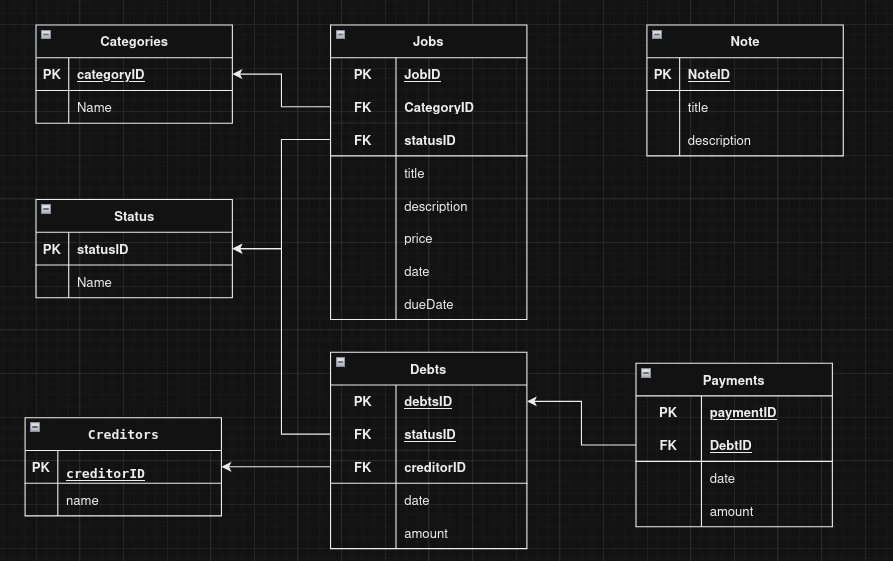

# DailyWork

Welcome to DailyWork, an application designed to quickly and easily track the amount of jobs I do in my daily life as a refrigeration technician.

## Database Structure

## To-Do

### Jobs page

- [X] Create Jobs page.

- [X] Create list to viewing all Jobs.

- [X] Create button to add a new job.

- [X] Create modal to add a new job.

- [X] Set a Dropdown to select Category & Status

- [X] Set Date Picker

- [X] Configure a connection with a SQL DDBB

- [X] Be able to create new categories

- [X] Be able to create new Status

- [X] save the jobs in the database

- [ ] View jobs from database

- [ ] fix style isues (dark mode) 

### Debs page

- [X] Create Debs page.

### Reports Page

- [X] Create Reports page.
